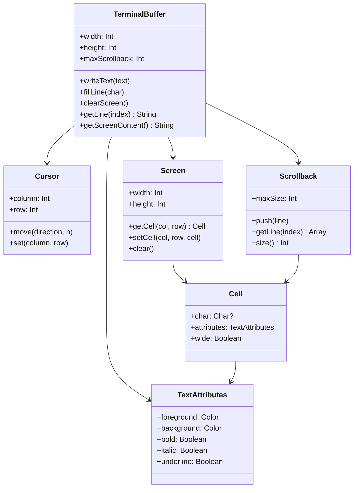
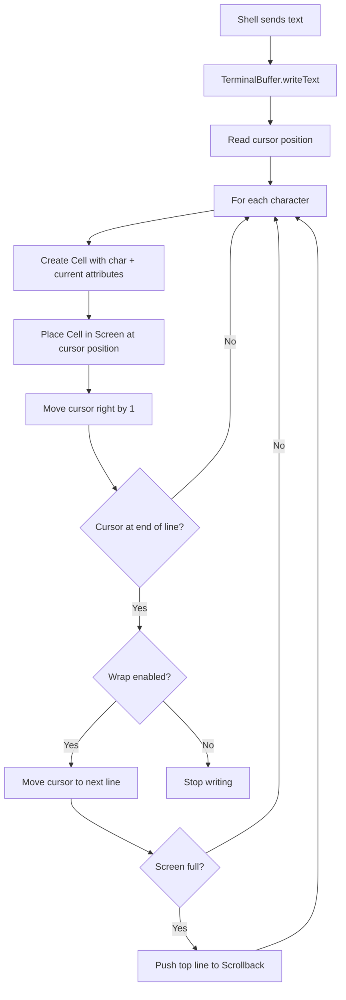

# Terminal Buffer

Implementation of a terminal text buffer in Kotlin for JetBrains internship task.

## Requirements

- Kotlin 1.9+
- Java 23
- Gradle 8.13

## Build
```bash
./gradlew build
```

## Run tests
```bash
./gradlew test
```

## Architecture


## Flow


## TODO

### Setup
- [x] Project structure with Kotlin + Gradle
- [x] Cell data class (character, foreground, background, style flags)
- [x] TerminalBuffer class with width, height, scrollback

### Cursor
- [x] Get/set cursor position
- [x] Move cursor up, down, left, right by N cells
- [x] Cursor bounds checking

### Attributes
- [x] Set foreground color
- [x] Set background color
- [x] Set style flags (bold, italic, underline)

### Editing
- [x] Write text at cursor position
- [ ] Insert text with wrapping
- [x] Fill line with character
- [x] Insert empty line at bottom
- [x] Clear screen
- [x] Clear screen and scrollback

### Content Access
- [x] Get character at position (screen and scrollback)
- [x] Get attributes at position (screen and scrollback)
- [x] Get line as string
- [x] Get entire screen as string
- [x] Get screen + scrollback as string

### Tests
- [x] Basic operations
- [ ] Edge cases and boundary conditions

### Bonus
- [ ] Wide characters (CJK, emoji)
- [ ] Resize