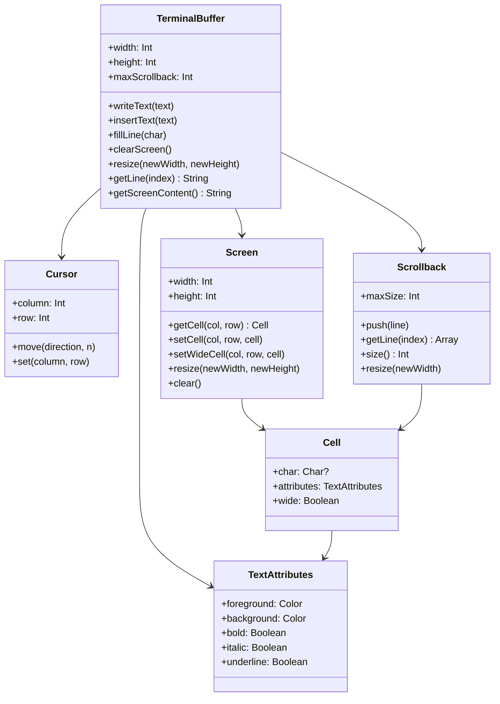
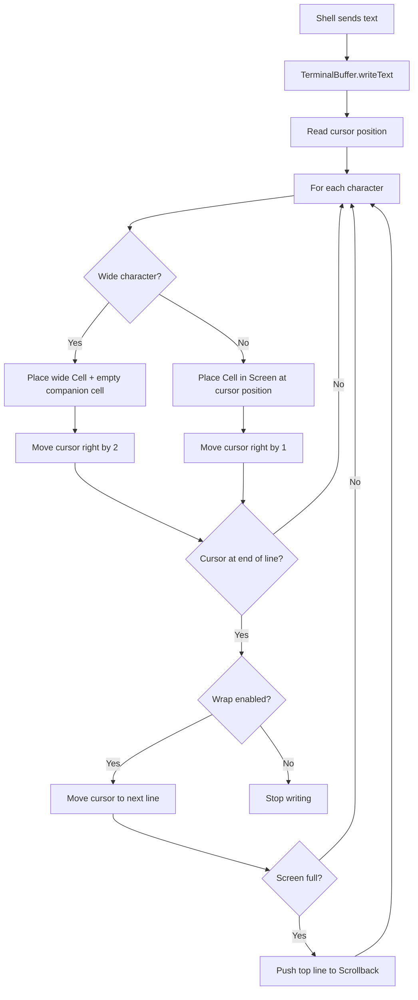

# Terminal Buffer

Implementation of a terminal text buffer in Kotlin for JetBrains internship task.

## Requirements

- Kotlin 2.2+
- Java 23
- Gradle 8.13

## Build
```bash
./gradlew build
```

## Run tests
```bash
./gradlew test
```

## Architecture


## Flow


## Design Decisions

**ArrayDeque for Scrollback** — allows efficient push and eviction
from both ends without copying the entire structure.

**Immutable Cell** — Cell is a data class, meaning it is replaced
rather than mutated. This avoids bugs from shared state.

**Cursor bounds enforced internally** — Cursor uses coerceIn so
it is impossible to place it outside the screen from anywhere
in the codebase.

**Screen and Scrollback are separate** — Screen is mutable and
editable, Scrollback is read-only history. Keeping them separate
makes the distinction clear and prevents accidental edits to history.

**Wide character support** — characters detected as wide (CJK ideographs
and common emoji) occupy two cells. The first cell holds the character,
the second is an empty companion cell with `wide = true`. The cursor
advances by 2. Known limitation: emoji above U+FFFF represented as
surrogate pairs are not yet handled.

**Resize uses clip/pad strategy** — when the screen grows, new cells are
filled with empty `Cell()`. When it shrinks, content beyond the new bounds
is clipped. Scrollback lines are resized the same way. The cursor is clamped
to the new bounds by recreating the `Cursor` object with the new dimensions.

## Future improvements

**Thread safety** — currently `TerminalBuffer` is not thread-safe. In a real
terminal emulator the shell writes and the UI reads concurrently. A
`ReentrantLock` or Kotlin coroutines would be needed.

**Tab character support** — `\t` should move the cursor to the next multiple
of 8 columns rather than writing a literal tab character.

**Dedicated scrollback access** — a `getScrollbackLine(index)` method to
replace the negative index convention in `getLine`, which is convenient
but not immediately obvious to a new reader.

**Variable length lines in scrollback** — instead of fixed-size arrays,
to save memory for lines that are mostly empty.

**Full emoji support** — emoji above U+FFFF require handling surrogate pairs
at the `String` iteration level rather than `Char` by `Char`.

**Resize with reflow** — the current strategy clips and pads. A more
advanced implementation would reflow content into the new width, preserving
all characters as modern terminals like iTerm2 and kitty do.